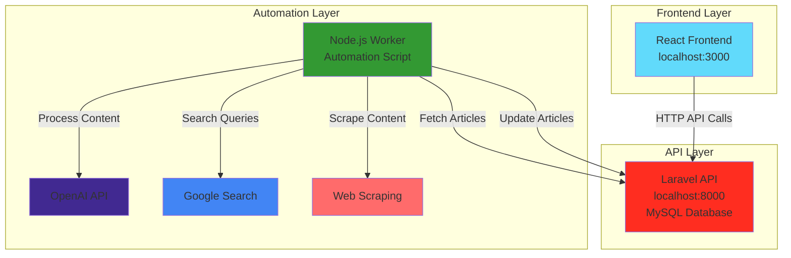

# BeyondChats Assignment Architecture

## System Architecture Diagram

## Data Flow

1. **Laravel API (Source of Truth)**
   - MySQL database stores articles
   - RESTful API endpoints for CRUD operations
   - Handles all data persistence

2. **Node.js Automation Worker**
   - Fetches unprocessed articles from Laravel
   - Searches Google for related content
   - Scrapes web pages for additional context
   - Processes content with OpenAI API
   - Updates Laravel with enhanced content and references

3. **React Frontend**
   - Consumes data from Laravel API
   - Displays side-by-side comparison
   - Shows original vs AI-enhanced content
   - Displays reference sources and citations

## Technology Stack

- **Backend**: Laravel 9, MySQL
- **Automation**: Node.js, Puppeteer, Cheerio, OpenAI
- **Frontend**: React 18, Axios, CSS3
- **Deployment**: Monolithic Git repository structure

## Key Features

- **Content Scraping**: Automated article collection
- **AI Enhancement**: OpenAI-powered content rewriting
- **Reference Tracking**: Citation management for sources
- **Real-time Updates**: Live content comparison
- **Responsive Design**: Mobile-friendly interface
